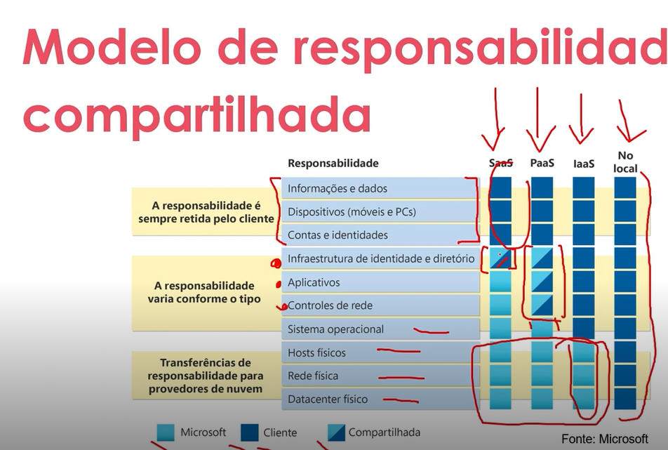

# Lab-Dio-AzureEssentials

# Meu Resumo Módulo Git, GitHub e Introdução ao Azure

Olá, sou grato pelos ensinamentos passados até aqui.
Nessas aulas do Bootcamp Azure Essentials pude aprender como instalar o Git, criar e configurar uma conta no GitHub, criar um repositório, colaborar com um repositório Open Source, utilizar comandos para manipular os arquivos do repositório localmente, como os comando git clone, pull request, commit. Também já foi feito uma introdução no Azure, criando uma conta gratuita e explorando os diversos recursos que o Azure pode fornecer. Está sendo um desafio bastante inovador e válido nos dias de hoje, espero seguir com os aprendizados e poder evoluir profissionalmente. Muito Obrigado.

# Meu Resumo Módulo Benefícios na Nuvem

## Alta Disponibilidade

Significa o quanto as aplicações ou recursos de nuvem estão disponíveis sempre que necessário e a garantia de SLA de acordo com o contrato que ele se propõe a atender.

A alta disponibilidade deve garantir a disponibilidade máxima independete de interrupções ou eventos que possam ocorrer.

## Escalabilidade

Refere-se à capacidade de ajustar ou adicionar recursos para atender a demanda. É uma escala vertical. Exemplo: Aumentar a capacidade de discos rígidos devido ao crescimento natural de um banco de dados.

## Elasticidade

É quando você automatiza, ou mão, a criação de recursos para atender uma demanda por meio de expansão, e quando essa demanda cai automaticamente os recursos são desalocados e reduzidos horizontalmente. É possível configurar a expansão de recursos de acordo com um indicador, por exemplo: Quando tivermos X acessos ao nosso site, aumente 1 servidor.

## Confiabilidade

Resiliência em criar recursos em diversos lugares do mundo, tornando nossas aplicações seguras, decentralizadas para se recuperar de desastres facilmente.

## Precisibilidade

Influencido pelo Microsoft Azure Architected Framework, um recurso do Azure que nos mostra os cases de sucesso.

## Segurança

O Azure fornece diversos recursos de segurança, porém a responsabiidade da Configuração é de responsabilidade do cliente, então é necessário criar regras e modelos de segurança para se previnir de possíveis ataques, como por exemplo atualização de hotfix e patches do Windows.

## Governança

Quais são os padrões de gerenciamento da computação em nuvem que serão implementados no ambiente, está associado a segurança e politicas que estejam em conformidade com o negócio e a padrões corporativos que a empresa\cliente deve atender.

## Gerenciabilidade

São as formas e as ferramentas disponíveis para gerenciar o ambiente em nuvem, exemplo:
    
    Navegador\Portal
    Linha de Comando
    API
    Power Shell
    Terraform

É possível escalar automaticamente a implantação de recursos com base na necessidade.

É possível implantar recursos com base em um modelo pré-configurado, ermovendo a necessidade de configuração manual.

# TIPOS DE SERVIÇO DE NUVEM

## IaaS (Infraestrutura como serviço)

    Serviços de Nuvem mais flexível.
    Você configura e gerencia o hardware para o seu aplicativo.
    Necessita de configuração e personalização dos recursos, exemplos de recursos:
    Servidores e Armazenamento
    Firewalls\Segurança de rede
    Planta física\edifício do datacenter

## PaaS (PLataforma como serviço)

    Focado no desenvolvimento de aplicativos.
    O gerenciamento de plataforma é de responsabilidade do provedor de nuvem.
    Além dos recursos acima, o PaaS também engloba Sistemas Operacionais, ferramentas para desenvolvedores, análise de negócios de gerenciamento de database.
    Um exemplo, é um banco de dados hospedado em nuvem, onde usamos apenas a plataforma de database e não me preocupo com o servidor onde ele está hospedado.

## SaaS (Software como serviço)

    Modelo de preço de pagamento conforme uso.
    Os usuários pagam pelo software que utilizam em um modelo de assinatura.
    São os aplicativos e apps hospedados na nuvem, são aplicativos licenciados, exemplo: Office 365, email, calendários, Netflix, Spofify.

# MODELO DE RESPONSABILIDADE COMPARTILHADA

# COMPONENTES DE ARQUITETURA DO AZURE

Os componentes de arquitetura do Azurereferir-se

## Computação
   
    Máquinas Virtuais (VMs)
    Serviços de aplicativos
    Serviço Azure Kubernetes (AKS)
    Funções do Azure

## Rede
    Rede Virtual (VNet)
    Balanceador de Carga do Azure
    Gateway VPN

## Armazenamento
    Armazenamento de Blobs do Azure
    Arquivos do Azure
    Armazenamento em disco do Azure

## Bancos de Dados
    Banco de Dados SQL do Azure: Banco
    Cosmos DB
    PostgreSQL

## Monitoramento e Gerenciamento
    Monitor do Azure
    Central de Segurança do Azure
    Automação do Azure

## Identidade e Acesso
    Diretório Ativo do Azure (Azure AD)
    Controle de acesso baseado em função (RBAC)

## Ferramentas de Integração
    Aplicativos lógicos do Azure
    Ônibus de serviço
    Grade de eventos

## Segurança
    Cofre de Chaves do Azure
    Firewall do Azure
    Proteção DDoS

## Aprendizado de Máquina e IA
    Aprendizado de máquina do Azure
    Serviços Cognitivos

## DevOps e Desenvolvimento
    Azure DevOps
    Pipelines do Azure
    
Esses componentes são combinados para formar soluções robustas e escaláveis ​​na nuvem, cada uma atendendo a diferentes necessidades.

# Pares de Região (Region Pairs)

Pares de Região garantem alta disponibilidade e resiliência, proporcionando replicação geográfica de dados e continuidade dos serviços em caso de falhas.

Características principais:

    Alta Disponibilidade
    Replicação de Dados
    Distância Física
    Atualizações Planejadas

## Exemplo de Pares

    Leste dos EUA eOeste dos EUA
    Leste da Austrália e Sudeste da Austrália
    Norte da Europa e Oeste da Europa
    
Esses pares garantem que, em caso de falha de uma região inteira (como desastres naturais ou problemas técnicos significativos), a região emparelhada pode continuar funcionando com seus dados e serviços replicados.

# Grupos de Recursos (Resource Groups)

Grupos de Recursos permitem organização eficiente e gerenciamento centralizado de recursos, facilitando a administração de soluções no Azure.

Características:
    
    Organização
    Gerenciamento Coletivo
    Controle de Acesso
    Tags
    Ciclo de Vida dos Recursos

# Assinaturas do Azure e Grupos de Gerenciamento

No Azure, Assinaturas e Grupos de Gerenciamento são componentes chave para estruturar a governança, controle de custos e organização de recursos, especialmente em ambientes complexos com múltiplas equipes e projetos. Vamos explorar cada um desses conceitos:

## 1. Assinaturas do Azure

Uma Assinatura do Azure é a base de cobrança e organização para o uso dos serviços do Azure. É uma entidade que agrupa e gerencia recursos, permitindo a criação e o gerenciamento de orçamentos, políticas e controles de acesso.

Assinaturas do Azure são essenciais para controlar os custos e organizar recursos. Elas fornecem limites e isolamento lógico para projetos ou departamentos dentro de uma empresa.

Características principais:

**Identificação e Cobrança:** Cada assinatura tem uma identificação única e está associada a um plano de pagamento. Todos os recursos criados sob essa assinatura são contabilizados juntos e a fatura é gerada com base no uso.

**Limites de Recurso:** Assinaturas impõem limites para os recursos, como o número de máquinas virtuais, serviços de rede, e outros. Isso ajuda a garantir que uma única assinatura não consuma excessivamente os recursos disponíveis.

**Segregação de Projetos:** Empresas podem criar várias assinaturas para diferentes projetos, departamentos ou unidades de negócio. Isso facilita a separação de responsabilidades e também permite orçamentos específicos para cada assinatura.

**Controle de Acesso:** Com Azure Role-Based Access Control (RBAC), você pode controlar o nível de permissão dos usuários em cada assinatura, desde o gerenciamento completo até o acesso de leitura.

**Restrições Regionais:** Cada assinatura pode ter recursos distribuídos em várias regiões, mas as políticas e limites podem ser aplicados globalmente ou por região.

Exemplo:
Imagine uma organização com dois departamentos principais: TI e Desenvolvimento de Produtos. Cada departamento pode ter sua própria assinatura para isolar recursos e atribuir orçamentos distintos, mantendo a cobrança separada e gerenciável.

Tipos de Assinaturas:

**Assinatura Gratuita:** Para novos usuários, permitindo o uso de alguns serviços sem custo por um período limitado.

**Pay-as-you-go (Pague Conforme o Uso):** Cobrança com base no consumo de recursos.

**Enterprise Agreement (Contrato Empresarial):** Geralmente utilizado por grandes organizações, oferecendo condições específicas com base no volume de uso.

**Assinaturas de Desenvolvimento/Teste:** Oferecidas a desenvolvedores, com descontos para ambientes de não produção.

## 2. Grupos de Gerenciamento (Management Groups)

Os Grupos de Gerenciamento no Azure são uma camada de organização acima das assinaturas. Eles permitem que várias assinaturas sejam agrupadas para fins de governança, controle e aplicação de políticas comuns. Isso é especialmente útil em grandes organizações que possuem múltiplas assinaturas.

Grupos de Gerenciamento facilitam a governança e a aplicação de políticas sobre múltiplas assinaturas, garantindo que grandes organizações possam aplicar consistência e conformidade de maneira eficiente.

Características principais:

**Hierarquia de Governança:** Os grupos de gerenciamento permitem criar uma hierarquia, onde você pode definir políticas e controles que se aplicam a todas as assinaturas subordinadas. Isso garante que todas as assinaturas sigam as mesmas diretrizes de conformidade e segurança.

**Aplicação de Políticas (Azure Policy):** As políticas podem ser aplicadas nos grupos de gerenciamento para impor regras como o uso de regiões específicas, o tipo de recursos que podem ser criados, ou requisitos de segurança (como criptografia de dados). Essas políticas são herdadas por todas as assinaturas dentro do grupo.

**Controle Centralizado:** Permite gerenciar múltiplas assinaturas como uma única entidade. Isso simplifica o gerenciamento de grandes ambientes do Azure, onde dezenas ou centenas de assinaturas precisam ser gerenciadas.

**Segurança e Compliance:** O uso de Azure Blueprints permite aplicar padrões de conformidade e melhores práticas a nível de grupo de gerenciamento, garantindo que todas as assinaturas sob o grupo sigam esses padrões.

**Estrutura Hierárquica:**
Raiz: No topo da hierarquia de um diretório do Azure Active Directory (Azure AD), existe um grupo de gerenciamento raiz. Todas as assinaturas e grupos de gerenciamento existentes em um diretório estão subordinados a esse grupo raiz.

**Subgrupos:** Você pode criar subgrupos dentro de grupos de gerenciamento para organizar assinaturas conforme necessário (por departamento, projeto, ou localização geográfica).

Exemplo:

Uma empresa global pode organizar seus recursos do Azure da seguinte maneira:

    No topo, o Grupo de Gerenciamento Raiz. Abaixo, dois Grupos de Gerenciamento, um para América do Norte e outro para Europa.
    Dentro do Grupo de Gerenciamento da América do Norte, há assinaturas para Recursos de Produção e Desenvolvimento e Teste.
    Com essa estrutura, a empresa pode aplicar políticas de conformidade mais rigorosas ao grupo de gerenciamento de produção 
    e políticas mais flexíveis ao grupo de desenvolvimento.

## Comparação e Relação entre Assinaturas e Grupos de Gerenciamento

**Escopo:** Enquanto as assinaturas servem como uma unidade de cobrança e organização de recursos, os grupos de gerenciamento agregam várias assinaturas para facilitar a aplicação de políticas e controles de governança em larga escala.

**Governança Centralizada:** Os grupos de gerenciamento permitem que você aplique políticas e controle o acesso de forma centralizada, enquanto as assinaturas são usadas principalmente para organizar projetos e gerenciar custos.

**Segregação:** Assinaturas podem ser usadas para isolar diferentes projetos ou departamentos, enquanto os grupos de gerenciamento ajudam a agrupar várias assinaturas de acordo com a estrutura organizacional.
